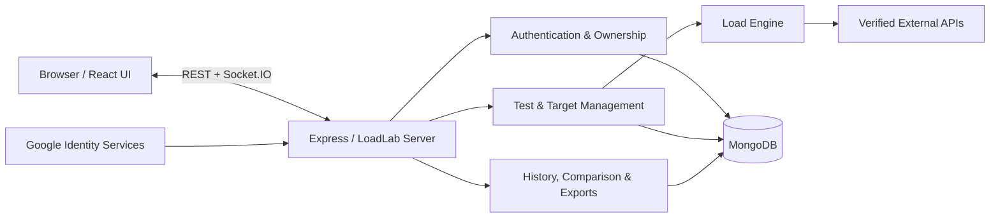

# LoadLab

LoadLab is an API load-testing and performance-analysis platform for running controlled tests against APIs you own. Observe live metrics, persist results, compare completed runs, and export reports.

**Live Application:** https://loadlab.onrender.com

## Features

- Configurable virtual users, duration, ramp-up, request-start rate, connection limits, and timeouts
- GET, POST, PUT, PATCH, and DELETE requests with validated custom headers and optional JSON bodies
- Live performance and load-generator health metrics through authenticated Socket.IO connections
- Persisted test plans, run history, filtering, pagination, and run cancellation
- Completed-run comparison, metric deltas, time-series charts, and JSON/CSV exports
- Ownership verification for external targets before they can be tested
- Email/password and Google Sign-In with user-scoped plans, targets, runs, and live rooms
- Single-origin Express production deployment with Docker support

## Tech Stack

| Area            | Technologies                                                        |
| --------------- | ------------------------------------------------------------------- |
| Frontend        | React, Vite, React Router, Recharts, Socket.IO Client, Tailwind CSS |
| Backend         | Node.js, Express, Socket.IO, Undici                                 |
| Database        | MongoDB, Mongoose                                                   |
| Auth & security | JWT, Google Identity Services, bcrypt, Zod, Helmet                  |
| Infrastructure  | Docker, Render                                                      |
| Testing         | Vitest, Testing Library, Supertest, ESLint, Prettier                |

## Architecture



In production, Express serves the React application, REST APIs, and Socket.IO from one origin. MongoDB persists users, verified targets, test plans, run snapshots, and final results. The load engine uses virtual-user loops, bounded connections, request-rate control, cancellation, and periodic metric snapshots.

## Testing Your Own API

Only test systems you own or have explicit authorization to test.

### 1. Sign in

Open [LoadLab](https://loadlab.onrender.com) and sign in with email and password or Google.

### 2. Add your target

Open **Verified Targets** and enter the HTTP or HTTPS origin of an API you control:

```text
https://api.example.com
```

Use a standard HTTP/HTTPS port and omit paths, queries, fragments, and embedded credentials. Configure the endpoint path later.

### 3. Verify ownership

LoadLab generates a verification token. Make your server return that exact token from `/.well-known/loadlab-verification.txt`:

```js
app.get('/.well-known/loadlab-verification.txt', (req, res) => {
  res.type('text/plain').send(process.env.LOADLAB_VERIFICATION_TOKEN);
});
```

```env
LOADLAB_VERIFICATION_TOKEN=<token-generated-by-loadlab>
```

Use the generated token, deploy the endpoint, then click **Verify** in LoadLab. The endpoint must return HTTP 200 with exactly that token in its response body.

### 4. Create a test plan

Select the verified target and configure its endpoint path, HTTP method, virtual users, duration, ramp-up, request rate, connection limit, timeout, and optional headers or JSON body.

### 5. Start and review the test

Watch live metrics during the run. Afterward, inspect saved final metrics and time-series data, browse history, compare completed runs, or export JSON/CSV reports. Start with a small load and increase it gradually.

## Metrics & Security

API performance metrics include completed and successful requests, HTTP and network errors, timeouts, RPS, average/minimum/maximum latency, p50/p95 latency, and active or peak virtual users. RPS counts completed request attempts, including successful and failed requests.

**Load Generator Health** reports CPU, peak RSS memory, heap usage, and event-loop delay for the LoadLab process generating traffic. It can reveal generator bottlenecks but does not represent CPU or memory usage of the target API server.

External targets require token-based ownership verification, and application data, exports, and live rooms are user-scoped. Production blocks local, loopback, private, link-local, and unsafe destinations through DNS, redirect, and pre-execution safety checks.

Authentication uses short-lived, in-memory access JWTs and signed HttpOnly refresh cookies; protected REST and Socket.IO traffic uses the access token.

## Running Locally

Supported Node.js range: `>=22.16.0 <23`.

```bash
git clone https://github.com/itsabhay1/LoadLab.git
cd LoadLab
npm ci
cp backend/.env.example backend/.env
cp frontend/.env.example frontend/.env
```

Fill in the required values using both example files as the source of truth, then start the frontend and backend:

```bash
npm run dev
```

For development-only local targets, run `npm run dev:mock` in another terminal.

## Docker & Deployment

The multi-stage Dockerfile builds the Vite frontend, installs backend production dependencies separately, and runs Express as a non-root user. One application serves the frontend, API, and Socket.IO.

```bash
docker build \
  --build-arg VITE_GOOGLE_CLIENT_ID="your-google-client-id" \
  -t loadlab .
```

Supply runtime configuration from the `.env.example` files through secure environment settings. LoadLab is hosted on Render at https://loadlab.onrender.com.

## Testing

```bash
npm run check
```

This runs ESLint, verifies Prettier formatting, executes the Vitest suite, and builds the production frontend.

## Author

**Abhay Agrawal**

GitHub: [@itsabhay1](https://github.com/itsabhay1)
